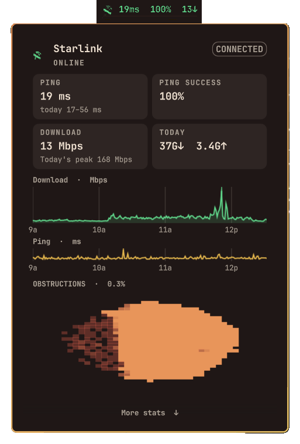

# Starlink

Unofficial Omarchy bar widget for a local Starlink dish. It is not affiliated
with SpaceX or Starlink.



The chip shows **latency**, **ping success**, and **last-minute active
download**. Left-click opens today's charts, obstruction map, and dish
details.

Talks to the dish on the LAN only (`192.168.100.1:9200` by default). No
Starlink account, no cloud API.

Every second of dish telemetry is stored in
`~/.cache/omarchy/starlink/samples.sqlite`. Charts and averages come from
that log. Download numbers are typical active throughput (idle ignored,
fastest 10% dropped), not a speed-test result.

## Install

```sh
omarchy plugin add https://github.com/wvdominick/omarchy-starlink.git --enable
```

Move it later with:

```sh
omarchy bar move wvdominick.starlink --section right
```

## Usage

- Bar reads like `21ms  99%  12↓`: live latency, 15-minute ping success,
  last-minute average active download
- Text turns amber if ping is over 60 ms or success drops under 98.5%,
  and red over 100 ms, under 95%, or when the dish is obstructed
- Left-click opens the details panel
- Middle-click refreshes
- Right-click sends a desktop notification
- `R` inside the panel refreshes
- Escape closes the panel
- If a newer version is on GitHub, **Update this panel** appears at the
  bottom. It runs `omarchy plugin update wvdominick.starlink` and restarts
  the shell so the new code loads.

Quiet hours on the day chart stay blank on purpose.

## Configure

```sh
omarchy bar set wvdominick.starlink refreshIntervalSec 5
omarchy bar set wvdominick.starlink dishHost 192.168.100.1:9200
```

`fetch.py` also honors `STARLINK_DISH_HOST` / `STARLINK_HOST`, and falls back
to `dishy.starlink.com:9200` if the default address does not answer.

## Requirements

- `curl` with HTTP/2 (Omarchy's curl already has this)
- Python 3
- Dish reachable at `192.168.100.1:9200` on the LAN

No gRPC Python packages are needed.

## Update

Open the panel. If GitHub is ahead of the installed checkout, **Update this
panel** appears under the dish details.

From a terminal:

```sh
omarchy plugin update wvdominick.starlink
```

## Remove

```sh
omarchy plugin remove wvdominick.starlink
```
